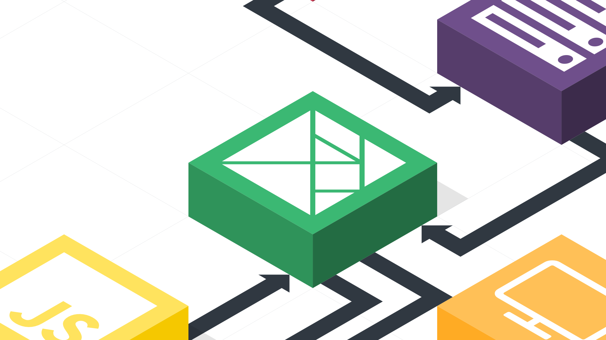
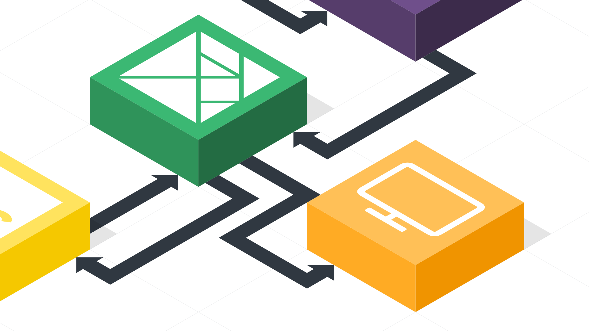
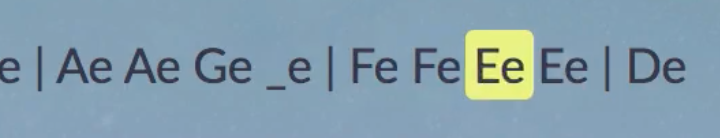

build-lists: true
autoscale: true

# Building Nightingale.space


with [@splodingsocks](http://www.twitter.com/splodingsocks)

^
- Name
- Place of employment
- Highlight my socks

---

# Better with Friends


^
- Elm is very cool on its own
- It can be even better when paired with other tech.

---

# Big Picture


^
- Hence this demo
- Big picture of a problem solved with Elm & other tools

---

# Big Picture


^
- Won't go into many code details in this talk
- Hope to focus on the concepts used, instead of the code that was written

---

# The Scenario

^
- Time to pretend
- We're a small consultancy
- A friend of ours has just approached us with a new project

^
- She has come up with a compact musical notation that will fit a good chunk of music into 140
characters
- She wants us to teach the browser to play the music encoded in that notation
- Her vision includes a client that streams in tweets, parsing them and queueing
them up to be played as they happen
- Ultimately allowing users to listen to a never-ending piece
of real-time music, composed by a symphony of twitter users world-wide

---

# The Scenario (Notation)

To play a note, the user types:

```
- A letter, optionally followed by a `+` (for a sharp), or a `-` (for a flat)
  or the _ character, to indicate a rest
- Optionally a letter defining the length of the note. If unspecified, "s" will be assumed.
  - t = 32nd note
  - s = 16th note
  - e = 8th note
  - q = Quarter note
  - h = Half note
  - w = Whole note
- Optionally a number, 0-8, defining the octave in which the note should be played, the default
  being 3
```

^
- Here's what the notation looks like

---

# The Scenario (Notation)

```
B-s2 (Low B flat 16th note)

Broken up:

B               -      s                                           2
^ The "b" note  ^flat  ^ hold for the length of a sixteenth note   ^ play in the second octave
```

^
- Here's an example of one note

---

# The Scenario (Notation)

```
Ce   Ce  Ge   Ge | Ae Ae  Ge   _e     | Fe  Fe Ee  Ee  | De   De  Ce  _e
Twin-kle Twin-kle  Li-tle star (rest)   How I  won-der   what you are (rest)
```

^
- Here's an example of a little tune, one of my daughter's favorites

---

# The Scenario (Notation)

```
CeCeGeGeAeAeGe_eFeFeEeEeDeDeCe_e
^ Equivalent to the previous slide.
```

^
- The same tune
- All whitespace and extra characters taken out

---

# A Sneak Peek

---


^
- A sample of what we're going to end up with

---

# Getting it Done

1. Getting tweets to the browser
1. Parsing tweets & making notes
1. Playing sounds
1. Visualizing playback


^
- Enough design, implementation!
- Four general sections
- (Highlight parts of the map and how they correlate with points)

---


^
- 1. Getting tweets to the browser
- We'll be using the Elixir langauge, and its most popular Web framework, Phoenix

---

# A Disclaimer

^
- I don't actually know how to write Elixir code!
- I learned just about enough to make this happen.
- Instead of showing the acutal code that I wrote, I'll tell you what the server is doing with
plain old English.

---

# The Twitter Liaison

```elixir
defmodule Twitter do
  def reader(dest) do
    # - Runs perpetually (not tied to a request)
    # - Acts like a queue for tweets:
    # - "Catches" tweets as they come in
    # - Yields caught tweets on demand
  end

  def listener(callback, readerPID) do
    # - Makes sure a reader is running
    # - Re-runs itself recursively every N milliseconds
    # - Asks the reader for a new tweet & waits
    # - Calls the passed in callback with the new tweet
end
```


^
- (Introduce the reader first, and explain how it interacts with Twitter)
- (Introduce the listener and how it interacts with the reader)

---

#  Channels

```elixir
# Start is the main function that runs when the server first starts
def start(_type, _args) do
  #... other app stuff
  Twitter.listener &Nightingale.TweetsChannel.broadcast_tweet/1, Nil
end

def broadcast_tweet(tweet) do
  Nightingale.Endpoint.broadcast("tweets:lobby", "tweet", tweet)
end
```
^
- Phoenix provides what it calls "channels", which are **high-level wrappers** around **Web sockets**
- Enables easy and scalable reactive communication between client and server

^
- When the app starts, the Twitter listener is launched
- Whenever tweets are received, broadcast_tweet is called

^
- broadcast_tweet, when called, instantly pushes out a notification to all listening clients that we have a new tweet to parse

---

A tweet gets dropped into the tweets channel looking like this:

```json
{
  "author": "splodingsocks",
  "pic": "some/image/url.jpg",
  "text": "@elmconf CeCeGeGeAeAeGe_eFeFeEeEeDeDeCe_e"
}
```


---



^
- Getting tweets, parsing tweets & making notes
- On to Elm!

---

# Consuming a Phoenix Channel

Use `fbonetti/elm-phoenix-socket`!

```elm
-- in Main.elm
-- There's too much code to fit on the slide, so here's an exemplary excerpt!
initPhxSocket : Flags -> Phoenix.Socket.Socket Msg
initPhxSocket flags =
    Phoenix.Socket.init flags.websocketUrl
        |> Phoenix.Socket.withDebug
        |> Phoenix.Socket.on "tweet" "tweets:lobby" ReceiveTweet
```

^
  - The library provides:
    - A model to keep track of socket things
    - Its own Msg & Cmd types and update function
    - A subscription, for notifying about new messages

^
  - The user initializes the model with:
    - the url
    - the channel name
    - a Msg constructor
    - The library will wrap the socket message value in the provided constructor,
    and `update` will get called

---

# Parsing a tweet into notes

```elm

notes : Int -> String -> List Note

type Note = Note
  { tweetId : Int
  , letter : String
  , accidental : Maybe Accidental
  , octave : Int
  , length : String
  , parseStart : Int
  , parseEnd : Int
  }

```


^
- To play a tweet, we need to break it down into a list of notes
- Here's what the data type looks like. This correlates with the notation previously mentioned

---

#TDD!

```elm
  assertEqual (notes 0 "A+e2")
    [ Note
        { tweetId = 0
        , letter = "A"
        , accidental = Just Sharp
        , octave = 2
        , length = "e"
        , parseStart = 0
        , parseEnd = 4
        }
    ]
```

^
- While writing this part I found some TDD very helpful
- Above we have a sample string with just one note, and we're asserting that the `notes` function
turns it into the note we expected
- But how do we actually extract those values from a string?

---

# Parser Combinators FTW 🎉

[elm-combine](http://package.elm-lang.org/packages/Bogdanp/elm-combine/latest)

- Build a set of regexes that could exist in the string
- Define the order of precedence
- Use the parser library to step through the string by chunks of matched characters
- Win

^
- On a high level, elm-combine helps us to:
  - Extract a piece of information from a String
  - Keep track of where in the string that extraction happened
  - Keep track of what we have left to parse still

---
## Parsing: A set of regexes

```elm
noteRegex =
    "([a-gA-G_]).*?([+-])?.*?([tseqhwTSEQHW])?.*?([0-8])?"


notNoteRegex =
    "[^a-gA-G_@#]*"


hashOrMentionRegex =
    "[@|#]\\S+"
```

^
- These regexes do what their names suggest!

---
## Parsing : Define the order of precedence

```elm
(Combine.map (always "") (Combine.regex hashOrMentionRegex))
    <|> (Combine.regex noteRegex)
    <|> (Combine.regex notNoteRegex)
```

^
1. Throw away a hash or mention (we don't want to play those)
2. Check for a note
3. Check for anything that's not a note

---

## Parsing: Getting a note

```elm
parse : Int -> Combine.Context -> ( Maybe Note, Combine.Context )
parse tweetId context =
    let
        noteStrParser : Combine.Parser String
        noteStrParser =
            (Combine.map (always "") (Combine.regex hashOrMentionRegex))
                <|> (Combine.regex noteRegex)
                <|> (Combine.regex notNoteRegex)

        ( noteResult, newContext ) =
            Combine.parse noteStrParser context.input
    in
        case noteResult of
            Err _ ->
                ( Nothing, newContext )

            Ok noteStr ->
                ( fromString noteStr tweetId context.position
                    (context.position + newContext.position)
                , { input = newContext.input, position = newContext.position + context.position } )
```

^
- Apply the parser to the whole string of notes
- Get back a result with one of the following contents:

^ # Err
  - Ignore it!

^ # Just String
  - Empty
  - A single note inside
  - Characters, but no note

^
- Call `fromString` on that extracted string to get back a `Maybe Note`
- If a note could be extracted from the string, great! If not, Nothing!

---

# Rinse, repeat

^
- Add the result of the last parse to a list
- Run the parser again, this time with the new remaining string
- Keep running it until there's nothing left to parse
- Drop all `Nothing` values from the list, and extract all values from their `Just`s

---


^ Playing sounds

---

# Getting the notes to JS land: Ports


---

Outgoing

```elm
-- Elm
port play : List PortNote -> Cmd msg
```
```js
// JS
app.ports.play.subscribe(notes => {
  notes.forEach(player.queueNote)
})
```
Incoming

```elm
-- Elm
port playing : (Maybe PortNote -> msg) -> Sub msg

subscriptions =
    playing ShowPlaying
```
```javascript
// JS
app.ports.playing.send(note)
```

^
- On the top we're sending a list of (port)notes from Elm through a port called `play` to JS
- The list gets converted automatically into a javascript array of objects

^
- On the bottom we're sending a single (port)note to Elm through a port called `playing` from JS
- Once again, the values get converted automatically
- The app's `update` function gets called with the playing note wrapped in the `ShowPlaying` Msg

---

# PortNote?

^
What's a PortNote?

---

# PortNote!

```elm
type alias PortNote =
    { ...
    , accidental : Maybe String
    }

type Note = Note
    { ...
    , accidental : Maybe Accidental
    }
```

^
Ports only work with basic data types, namely: Numbers, Strings, Lists, Records, and Maybes.
(Maybes get coerced into a nullable value automatically)

^ So we have to convert our original note type, which uses custom types "Note" and "Accidental" to a
serializable structure before sending it through a port.

---

## Tone.js is neato

```js
// ... some code
const synth = new Tone.Synth().toMaster()
const part = new Tone.Part(function(curTime, note){

  let next = getNextNote()
  part.add('+32n', next)

  if (!note) {
    // ... more code
    // Notify Elm that we're not playing a note now
    onPlayNote(null)
    return
  }

  // Notify Elm that we're playing a note now
  onPlayNote(note)
  // ... even more code
}, [0]).start(0)
// ... the rest of the code
```

That's that for now.

^
- We won't delve into Tone.js's API. Just know that it lets us make a synth and play notes.
- As notes come in from elm, we throw them into a queue.
- Tone.js runs a callback when a note finishes playing, at that point we pop the next note off
the queue and play it.

---



^ Visualizing playback

---



---
# Visualizing Playback

```elm
  -- In the function that renders tweets
  let
      beforeHighlight =
          String.slice 0 note.parseStart tweet.text

      highlight =
          String.slice note.parseStart note.parseEnd tweet.text

      afterHighlight =
          String.slice note.parseEnd (String.length tweet.text) tweet.text
  in
      [ text beforeHighlight
      , p [ class "playing" ] [ text highlight ]
      , text afterHighlight
      ]
```

^ We get a PortNote in from our port, and we fetch the tweet that it's associated with

^ # We divide the tweet text into three parts
- Before the playing note
- The playing note
- After the playing note

^ Then we render them all on the page together, giving a special class to the text of the playing note.

^ This allows us to render that little yellow highlight

---

# DEMO TIME!!!!


^ Even though it's like playing with fire

---

```
- A letter, optionally followed by a `+` (for a sharp), or a `-` (for a flat)
  or the _ character, to indicate a rest
- Optionally a letter defining the length of the note. If unspecified, "s" will be assumed.
  - t = 32nd note
  - s = 16th note
  - e = 8th note
  - q = Quarter note
  - h = Half note
  - w = Whole note
- Optionally a number, 0-8, defining the octave in which the note should be played, the default
  being 3
```

## DO NOT TWEET YET!

But when you do, tweet with #elmconf

^ But first, we must review the notation

---

# Fin!

```
- Murphy Randle
- Bloom Built (Day One)
- @splodingsocks
- Be my friend!
```

**Some images © Photography by Jess**

**Other images from unsplash.com**

**Most icons from Font Awesome**

**Illustrations by yours truly**

^
- How to contact me
- Be my friend!

---

# Meetup


http://jsalt.space

Monthly meetings

In-person in Utah

Online everywhere else

Come join us!
