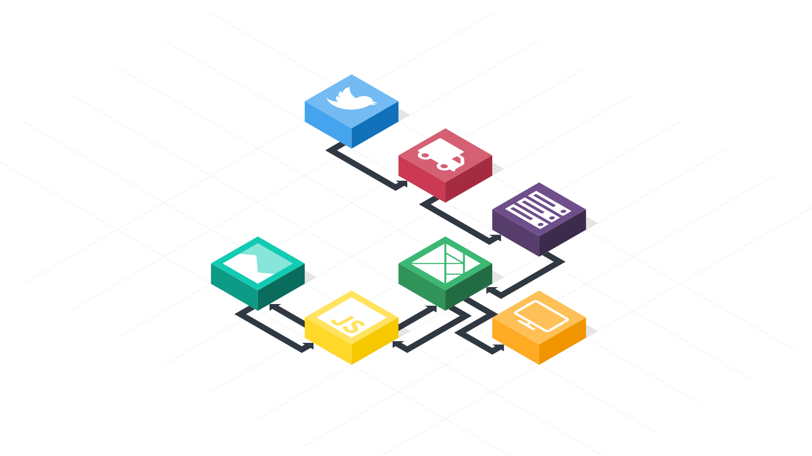
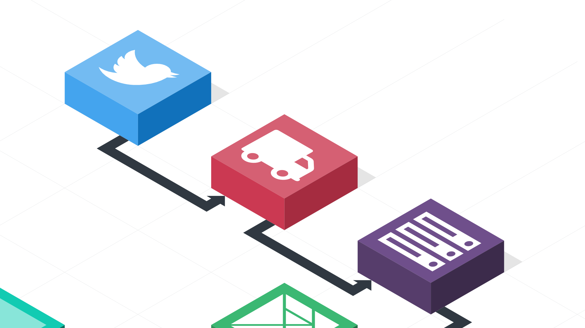

build-lists: true
autoscale: true

# Building Nightingale.space


with [@splodingsocks](http://www.twitter.com/splodingsocks)

---

# Better with Friends


^ Elm very cool on its own. But its better with friends.

---

# Big Picture


^ So I wanted to make a big-picture presentation, one that would not just explain Elm as a language, but demonstrate how it fits into an existing ecosystem of tools.

---

# The Scenario

^ In order to do this, let's pretend that we're a small consultancy and a friend of ours has just
approached us with a new project.

---

# The Scenario (Notation)

To play a note, the user types:

```
- A letter, optionally followed by a `+` (for a sharp), or a `-` (for a flat)
  or the _ character, to indicate a rest
- Optionally a letter defining the length of the note. If unspecified, "s" will be assumed.
  - t = 32nd note
  - s = 16th note
  - e = 8th note
  - q = Quarter note
  - h = Half note
  - w = Whole note
- Optionally a number, 0-8, defining the octave in which the note should be played, the default
  being 3
```

^ She has come up with a compact musical notation that will fit a good chunk of music into 140
characters, and she wants us to teach the browser to play the music encoded in that notation.
But that’s not all. Her vision includes a client that streams in tweets, parsing them and queueing
them up to be played as they happen, ultimately allowing users to listen to a never-ending piece
of real-time music, composed by a symphony of twitter users world-wide.

---

# The Scenario (Notation)

```
B-s2 (Low B flat 16th note)

Broken up:

B               -      s                                           2
^ The "b" note  ^flat  ^ hold for the length of a sixteenth note   ^ play in the second octave
```

---

# The Scenario (Notation)

```
Ce   Ce  Ge   Ge | Ae Ae  Ge   _e     | Fe  Fe Ee  Ee  | De   De  Ce  _e
Twin-kle Twin-kle  Li-tle star (rest)   How I  won-der   what you are (rest)
```

---

# The Scenario (Notation)

```
CeCeGeGeAeAeGe_eFeFeEeEeDeDeCe_e
^ Equivalent to the previous slide.
```

---



---

# Big Picture

1. Getting tweets to the browser (Phoenix)
1. Parsing tweets & rendering HTML (Elm)
1. Playing sounds (Javascript)

---

# Getting tweets to the browser



---

# Outline

```
2. Getting tweets from Twitter
3. Elixir : Using an async worker to listen to tweets
4. Phoenix : Setting up a channel to send tweets to the browser
5. Channels, client-side (getting Tweets)
6. elm-combine, building a tweet parser
7. Sending the tweets through ports to JS
8. Playing tweets with Tone.js
9. DEMO TIME!
```
---
